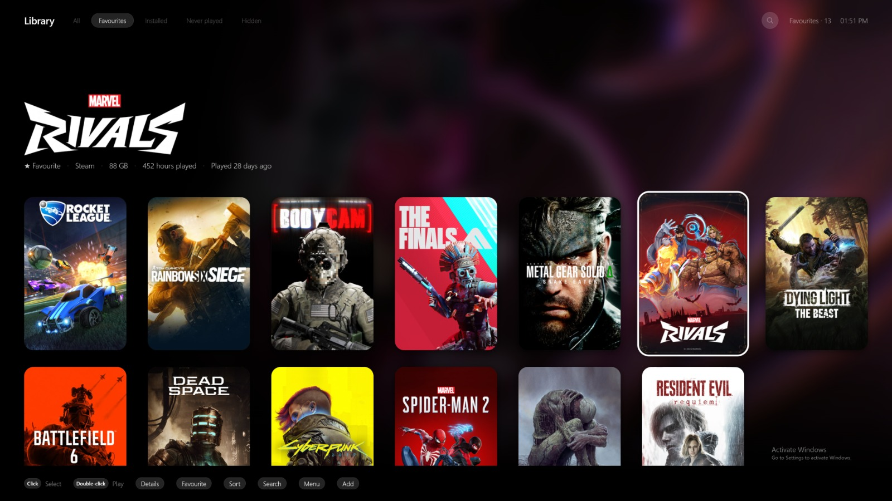

# Marquee

A controller-first game launcher for the television. One grid for every game
you own, whichever store it came from.

Runs on Windows, macOS and Linux. Built with Tauri v2: a Rust core and a
TypeScript frontend with no UI framework.



## What it does

- **Reads your Steam library on its own**, with cover art, and launches games
  with one button.
- **Adds anything else by name.** Epic, GOG, emulators, an old installer: type
  the title, pick the match, then point it at the executable.
- **Needs no account and no API keys.** A free
  [SteamGridDB](https://www.steamgriddb.com) key is optional and fills the gaps
  in Steam's artwork.
- **Works from the sofa.** Fullscreen by default, an on-screen keyboard, and
  every action reachable with a pad, a keyboard or a mouse alone.
- **Updates itself**, and checks every download against a public key built into
  the copy already running.

## Install

Download the newest build from
[Releases](https://github.com/FomasTreeman/marquee/releases/latest).

| | File | Note |
|---|---|---|
| Windows | `marquee_<version>_x64-setup.exe` or `.msi` | Not code-signed, so SmartScreen asks first: *More info → Run anyway* |
| macOS, Apple silicon | `marquee_<version>_aarch64.dmg` | Not notarised, so the first launch is right-click → Open |
| macOS, Intel | `marquee_<version>_x64.dmg` | As above |
| Linux | `.AppImage`, `.deb` or `.rpm` | The AppImage needs `chmod +x`. Linux has had much less use than the other two |

## Controls

| Pad | Keyboard | |
|---|---|---|
| D-pad / stick | Arrows, WASD | Move |
| **A** | Enter, Space | Play |
| **B** | Escape, Backspace | Back |
| **X** | X | Favourite |
| **Y** | Y | Details: rename, fix artwork, hide |
| **LB / RB** | Q / E | Switch tab: All, Favourites, Installed, Never played, Hidden |
| **L3** | O | Sort by recency, playtime, name or size |
| **R3** | / or F | Search, including genre and studio |
| **Start** | Tab, M | Main menu: settings, rescan, quit, restart, shut down |
| **Select** | N | Add a game by name |
| | F11 | Windowed or fullscreen |
| | P | Performance HUD |

## How it is built and shipped

The pipeline is as much a part of this project as the launcher.

- **Every pull request is built and tested on Linux, Windows and macOS**, with
  warnings treated as errors.
- **Merging to `main` is the release.** The release workflow waits for green CI
  on that exact commit, builds four targets, signs the update bundles, checks
  that the update manifest lists every platform, and only then publishes.
- **The update signing key** lives in a GitHub environment that only `main` can
  deploy from, so a pull request cannot reach it.
- **Every third-party action is pinned to a commit SHA.** A lint
  (`tools/check-workflows.py`) fails the build on an unpinned action, a job
  without explicit permissions or a timeout, or event data pasted into a shell
  script.
- **Secret scanning with push protection, private vulnerability reporting and
  Dependabot** are switched on.

[docs/SECURITY.md](docs/SECURITY.md) covers what the app itself can do and what
limits it. [docs/DEVSECOPS.md](docs/DEVSECOPS.md) lists the controls in place
and the ones still to add, with the trade-offs of each.

## How development works now

I built Marquee and then handed its ongoing development to an AI loop. People
decide what gets worked on and what ships; Claude Code does the work in
between.

1. **A person files an issue.**
2. **An agent fixes it.** Claude Code works from the issue and opens a pull
   request. If the issue needs a decision, it asks one question on the issue
   with the `needs-decision` label and waits for the reply.
3. **CI checks it** on Linux, Windows and macOS. If CI fails, an agent gets up
   to three attempts at a fix, then stops and asks.
4. **A second agent run reviews the diff** and leaves a comment. It cannot
   approve anything.
5. **A person reviews every pull request.** Nothing merges until they enable
   it, and merging starts the release.

Only someone with write access can start an agent run, and issue text is
treated as untrusted input. One gap is worth stating plainly: the human review
is a rule the project follows, not yet one GitHub enforces. Enforcing it is
the first item in [docs/DEVSECOPS.md](docs/DEVSECOPS.md).

[docs/AUTOMATION.md](docs/AUTOMATION.md) describes the whole loop.

## What is next

- **Catching problems before anyone files them.** A service that runs the
  launcher in a sandbox, exercises it the way a person would, and opens an
  issue when something breaks. That would close the loop: issues would come
  from testing as well as from people, and the agents would pick them up as
  usual.
- **Agents as a team with separate roles.** Today one agent writes and a
  second run reviews. The next step is distinct roles, such as a project
  manager that breaks down and prioritises issues, a developer and a reviewer,
  each with its own identity and only the permissions that role needs. A person
  still approves.
- **Better context management.** Each agent run starts cold and reads the same
  long instructions. Shorter briefs per role, and a summary carried from one
  run to the next, would make runs cheaper and more focused.
- **A route to running offline.** The loop depends on a hosted model through
  one action. Putting that behind a small interface would let a local model
  take some roles, for cost or for privacy. It is the least likely of these in
  the near term, because hosted models are well ahead for this kind of work.
- **The security list.** The open items in
  [docs/DEVSECOPS.md](docs/DEVSECOPS.md): static analysis, dependency auditing,
  build provenance and pinned toolchains among them.

On the launcher itself, not built yet: collections, games that are owned but
not installed, and running a hand-added Windows game on Linux.

## Building it

Rust stable, Node 20 and pnpm 9. On Linux, install the WebKitGTK toolchain
first:

```bash
sudo apt-get install libwebkit2gtk-4.1-dev libappindicator3-dev librsvg2-dev patchelf libudev-dev
```

Then:

```bash
pnpm install
pnpm app        # the app, in a Tauri window with your real library
pnpm dev        # a browser tab for CSS work only; add ?mock=40 for a fake library
pnpm test       # every check CI runs
pnpm tokens     # regenerate src/css/tokens.css from design/tokens.json
pnpm logs       # tail the log
pnpm build:windows   # cross-compile a Windows build from a Mac
```

`pnpm app` shows a HUD with frame rate, input latency and IPC round trip.
Frame numbers from `pnpm dev` are not reliable, because a background tab
throttles animation.

Design tokens live in `design/tokens.json` and are generated into CSS. Do not
edit `src/css/tokens.css` by hand; CI checks the two agree.

## Status

In daily use on a Windows machine in a lounge and a Mac on a desk, with a
library of a couple of hundred games. Linux is built and released from the same
commits but has not been lived with.

Measured on macOS with 2,000 cards: 0–2 dropped frames in 180, 0.3–2 ms input
latency, 0.35 ms IPC round trip.

## Documentation

| | |
|---|---|
| [docs/PLAN.md](docs/PLAN.md) | Scope, stack and priorities, and what was rejected |
| [docs/SECURITY.md](docs/SECURITY.md) | What a launcher can do, and what limits it |
| [docs/DEVSECOPS.md](docs/DEVSECOPS.md) | Pipeline security: what is in place and what is left |
| [docs/AUTOMATION.md](docs/AUTOMATION.md) | Issue to agent to pull request to review to release |
| [docs/UPDATES.md](docs/UPDATES.md) | How self-updating and signing work |
| [docs/DEBUGGING.md](docs/DEBUGGING.md) | The log and the self-check |
| [docs/WINDOWS.md](docs/WINDOWS.md) | Cross-compiling from a Mac |
| [CONTRIBUTING.md](CONTRIBUTING.md) | Conventions for changes |

## Why

[Playnite](https://playnite.link) is the reference and it is excellent: one
library across every store and a fullscreen mode built for a pad. It is also
Windows-only and heavier than a television interface needs to be. Marquee is
the same idea, cross-platform, with an interface that is plain CSS.

Priorities, in the order they break ties: performance, stability, UI.

## Licence

[PolyForm Strict 1.0.0](LICENSE.md). You may run it, read it and learn from it;
you may not redistribute it or ship something built from it. It is
source-available, not open source. The licensor is Thomas Freeman, and
contributions are welcome under the same terms.
